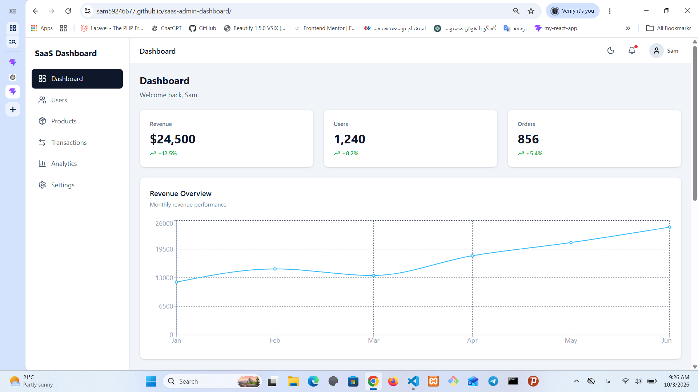

# SaaS Admin Dashboard

A modern and responsive **SaaS Admin Dashboard** built with React, TypeScript, Tailwind CSS, and modern frontend tools.

## 🚀 Live Demo

[View Live Demo](https://sam59246677.github.io/saas-admin-dashboard/)

## 📸 Preview



## 📌 About the Project

This project is a responsive admin dashboard designed for managing users, products, transactions, analytics, and application settings.

The project was built to practice modern React and TypeScript development, including state management, data fetching, form validation, routing, reusable components, and GitHub Pages deployment.

## ✨ Features

* Responsive admin dashboard
* User management
* Product management
* Product CRUD operations
* Search, filtering, sorting, and pagination
* Dashboard statistics
* Charts and data visualization
* Settings management
* Profile page
* Login page
* Protected routes
* Dark mode support
* Toast notifications
* Loading and error states
* Responsive sidebar navigation
* Code splitting with React lazy loading
* GitHub Pages deployment with GitHub Actions

## 🛠️ Technologies

* React
* TypeScript
* Vite
* Tailwind CSS
* React Router
* TanStack Query
* React Hook Form
* Yup
* Context API
* Recharts
* Lucide React
* Git & GitHub
* GitHub Actions

## 📂 Project Structure

```text
src/
├── components/
├── layouts/
├── pages/
├── routes/
├── services/
├── hooks/
├── context/
├── types/
└── App.tsx
```

## ⚙️ Installation

Clone the repository:

```bash
git clone https://github.com/sam59246677/saas-admin-dashboard.git
```

Go to the project directory:

```bash
cd saas-admin-dashboard
```

Install dependencies:

```bash
npm install
```

Start the development server:

```bash
npm run dev
```

The application will be available at:

```text
http://localhost:5173
```

## 🏗️ Build

To create a production build:

```bash
npm run build
```

The production files will be generated inside the `dist` folder.

## 🔍 Lint

Run ESLint with:

```bash
npm run lint
```

## 🚀 Deployment

This project is deployed to **GitHub Pages** using **GitHub Actions**.

Every push to the `main` branch automatically triggers a new deployment.

## 📱 Responsive Design

The dashboard is designed to work across:

* Desktop
* Tablet
* Mobile

## 📚 What I Practiced

While building this project, I practiced:

* React component architecture
* TypeScript
* React Router
* Protected routes
* Context API
* Server-state management with TanStack Query
* Form handling and validation
* API integration
* Reusable UI components
* Data visualization
* Responsive layouts with Tailwind CSS
* Code splitting and lazy loading
* Git and GitHub
* Continuous deployment with GitHub Actions

## 👨‍💻 Author

**Sam Rostami**

GitHub: [sam59246677](https://github.com/sam59246677)
